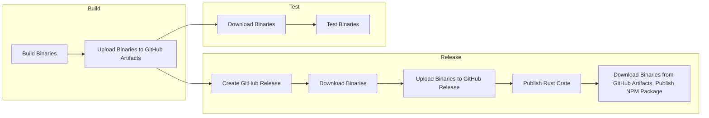

# FTA's CI

Chart

```mermaid
flowchart LR
  subgraph Build
    A["Build Binaries"] --> B["Upload Binaries to GitHub Artifacts"];
  end
  subgraph Release
    B --> D["Create GitHub Release"];
    D --> E["Download Binaries"];
    E --> F["Upload Binaries to GitHub Release"];
    F --> G["Publish Rust Crate"];
    G --> H["Download Binaries from GitHub Artifacts, Publish NPM Package"];
  end;
  subgraph Test
    B --> K["Download Binaries"];
    K --> L["Test Binaries"];
  end;
```
