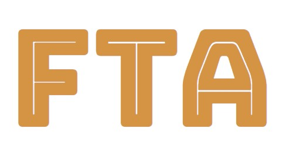

<p align="center">
  
</p>

<h2 align="center">
  Fast TypeScript Analyzer
</h2>

FTA (Fast TypeScript Analyzer) is a super-fast TypeScript static analysis tool written in Rust. It captures static information about TypeScript code and generates easy-to-understand analytics that tell you about complexity and maintainability issues that you may want to address.

FTA uses [swc](https://github.com/swc-project/swc) to parse your code then runs various analytical routines against it to understand how complex and maintainable it is likely to be.

JavaScript code is also supported.

## Getting Started

FTA is distributed as an npm module. You can call it:

- As a script that prints out information about your project (_Recommended_)
  - You can optionally set `score_cap` to require a minimum quality level in your CI (See [Configuration](#configuration))
- From code so that you can programmatically interact with the output

To install `fta`:

```bash
yarn add fta
# or
npm install fta
# or
pnpm install fta
```

Call fta from a scripting context:

```bash
yarn fta path/to/project
# or
npm run fta path/to/project
# or
pnpm fta path/to/project
```

or, call from code:

```javascript
import { runFta } from "fta";

const output = runFta("path/to/project", { json: true });

console.log(output); // Full output
```

It is also possible to make fta print the output is json in a scripting context:

```bash
yarn fta path/to/project --json
```

## Example

Example output against the Redux project (`yarn fta path/to/redux`):

```
| ----------------------------------------- | ------------ | ----------------------------- | ------------------- |
| File                                      |   Num. lines |   FTA Score (Lower is better) |          Assessment
| ----------------------------------------- | ------------ | ----------------------------- | ------------------- |
| src\createStore.ts                        |          490 |                         70.25 | (Needs improvement) |
| website\src\pages\index.js                |          218 |                         64.94 | (Needs improvement) |
| src\combineReducers.ts                    |          202 |                         61.61 | (Needs improvement) |
| src\compose.ts                            |           62 |                         52.68 |   (Could be better) |
| src\bindActionCreators.ts                 |           84 |                         51.89 |   (Could be better) |
| src\utils\kindOf.ts                       |           71 |                         48.80 |                  OK |
| src\utils\warning.ts                      |           19 |                         35.00 |                  OK |
| src\utils\isPlainObject.ts                |           15 |                         34.32 |                  OK |
| src\utils\symbol-observable.ts            |           11 |                         31.89 |                  OK |
| website\docusaurus.config.js              |          197 |                         18.04 |                  OK |
| website\sidebars.js                       |          149 |                         15.82 |                  OK |
| rollup.config.js                          |           80 |                         15.79 |                  OK |
| tsup.config.ts                            |           73 |                         15.59 |                  OK |
| src\applyMiddleware.ts                    |           78 |                         15.45 |                  OK |
| website\src\pages\errors.js               |           63 |                         15.09 |                  OK |
| website\src\js\monokaiTheme.js            |           63 |                         14.32 |                  OK |
| src\utils\actionTypes.ts                  |           18 |                         11.91 |                  OK |
| src\index.ts                              |           47 |                         11.84 |                  OK |
| vitest.config.ts                          |           18 |                          9.92 |                  OK |
| docs\components\DetailedExplanation.jsx   |           16 |                          9.67 |                  OK |
| src\utils\formatProdErrorMessage.ts       |           14 |                          8.57 |                  OK |
| ----------------------------------------- | ------------ | ----------------------------- | ------------------- |
21 files analyzed in 0.1079s.
```

## Configuration

To configure how FTA interprets a project, define a `fta.json` file in the project's root.

There are several options available:

- `output_limit`: How many files to include in the output.
  - **Default: 5000**
- `score_cap`: Maximum FTA score which will cause FTA to throw. Useful if you want to prevent any files being added to the project that exceed a certain maintainability level. For an existing project, you might opt to set this as your _curent-highest-fta-score_.
  - **Default: 1000**
- `exclude_directories`: An array of directory paths representing directories to exclude from the analysis. Files within any of these directories will be ignored. Paths can be specified as relative to the project root. The defaults are always used; any supplied values are added to the exclusions list.
  - **Default: `["/dist", "/bin", "/build"]`**
- `exclude_filenames`: An array of glob patterns representing filenames to exclude from the analysis. Files matching any of these patterns will be ignored. Globs can include wildcards and brace expansions. The defaults are always used; any supplied values are added to the exclusions list.
  - **Default: `[".d.ts", ".min.js", ".bundle.js"]`**
- `extensions`: File extensions to identify files that should be interpreted as TypeScript code. JavaScript files are also accepted. The defaults are always used; any supplied values are added to the inclusions list.
  - **Default: `[".js", ".jsx", ".ts", ".tsx"]`**

Example configuration `fta.json`:

```json
{
  "output_limit": 250,
  "score_cap": 90,
  "exclude_directories": ["__fixtures__"],
  "exclude_filenames": ["*.test.{ts,tsx}"],
  "extensions": [".cjs"]
}
```

Here, we've limited the output to 250 files, capped the FTA score to 90, excluded anything in the `/path/to/project/__fixtures__` dir, excluded test files and included files with the `.cjs` extension.

Note: spec/test files (that contain TypeScript or JavaScript code) are included by default, since they constitute material code that must be maintained. This is optional - users are free to exclude test code from outputs, like in this example.

## Scoring

For conveinience, FTA generates a single `FTA Score` that serves as a general, overall indication of the quality of a particular TypeScript file.

That said, all metrics are exposed and it is up to users to decide how it's metrics can enhance productivity for your team.

Under the hood, two key metrics are calculated:

- The Halstead Metrics: uses the unique and total number of operators and operands in the code to calculate several complexity measures such as size, vocabulary, difficulty, time to program and "delivered bugs".
- Cyclomatic Complexity: the effective number of distinct logical paths through the code

## Change Log

You can view releases of the FTA Rust crate on the GitHub [Releases](https://github.com/sgb-io/fta/releases) page.

You can also view the [CHANGELOG](https://github.com/sgb-io/fta/blob/main/CHANGELOG.md) file for changes.

## License

[MIT](LICENSE.md)
